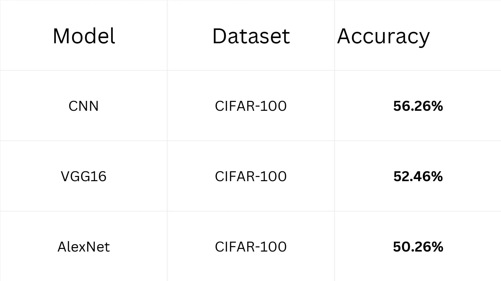

# Deep Learning Image Classification using CNN, AlexNet and VGG16

## Project Overview

This project was completed as part of my deep learning internship. The main objective was to understand image classification using different deep learning models and compare their performance on benchmark datasets.

The models implemented in this project are:

- Convolutional Neural Network (CNN)
- AlexNet
- VGG16

The models were trained and tested on different datasets to study how their performance changes with increasing dataset complexity.

## Datasets Used

- MNIST
- Fashion-MNIST
- CIFAR-10
- CIFAR-100

## Tools and Libraries

- Python
- TensorFlow
- Keras
- NumPy
- Matplotlib
- Scikit-learn
- Google Colab

## Model Performance

| Model | Dataset | Accuracy |
|------|---------|---------:|
| CNN | CIFAR-100 | 56.26% |
| VGG16 | CIFAR-100 | 52.46% |
| AlexNet | CIFAR-100 | 50.26% |

## Model Comparison

The following figure compares the final accuracy of all three models on the CIFAR-100 dataset.



## Project Structure

```
Deep-Learning-Image-Classification
│
├── notebooks
├── models
├── images
├── requirements.txt
└── README.md
```

## Key Learnings

Through this project, I learned:

- Image preprocessing
- Convolutional Neural Networks
- AlexNet architecture
- VGG16 architecture
- Batch Normalization
- Dropout
- Data Augmentation
- Hyperparameter tuning
- Model evaluation and comparison

## Future Scope

In the future, I plan to work with more advanced deep learning models such as ResNet and EfficientNet and further improve the classification accuracy.

## Author

Somayajula Sree Shashank

B.Tech, Computer Science and Engineering (Data Science)

GITAM University
